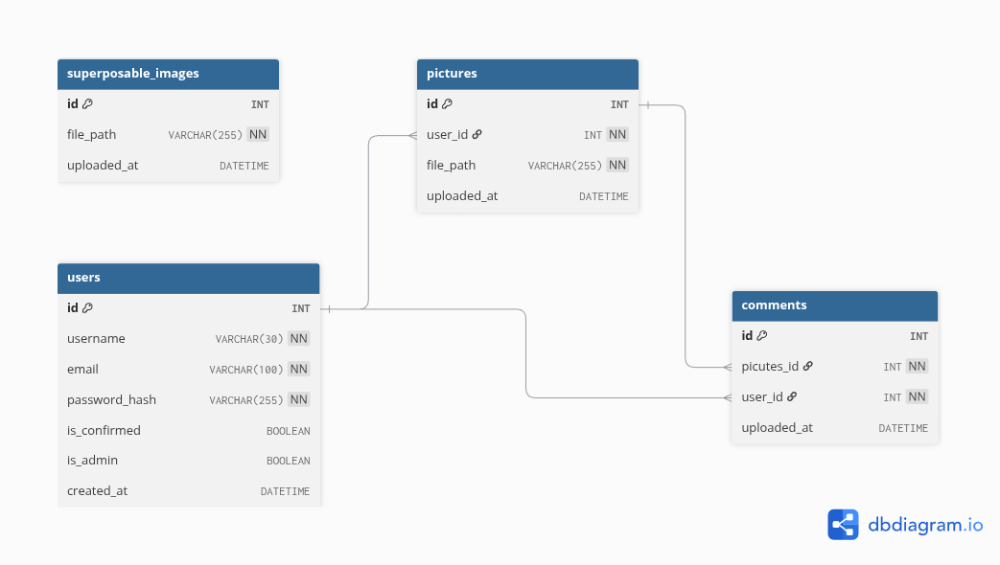

# Project

Camagru is a post-common-core 42 project. The goal of this project is to create an image sharing website, similar to Instagram.

# Stack
- Front-end : Javascript, HTML, css.
- Back-end : Php.
- webserver : nginx
- db : MySQL.

# Features
- Profile creation and login security (JWT).
- Take pictures from webcam or use user provided image, provide superposable images to add to pictures.
- Save final image locally.

# To be implemented
- A 'feed' of users shared images,
- Ability for users to interact with shared images by liking or commenting.
- Allow users to delete their own shared pictures.
- Superposable images can be GIFs (optional).
- Share user post to other social networks (optional).

# Database diagram

# Launching
`make`